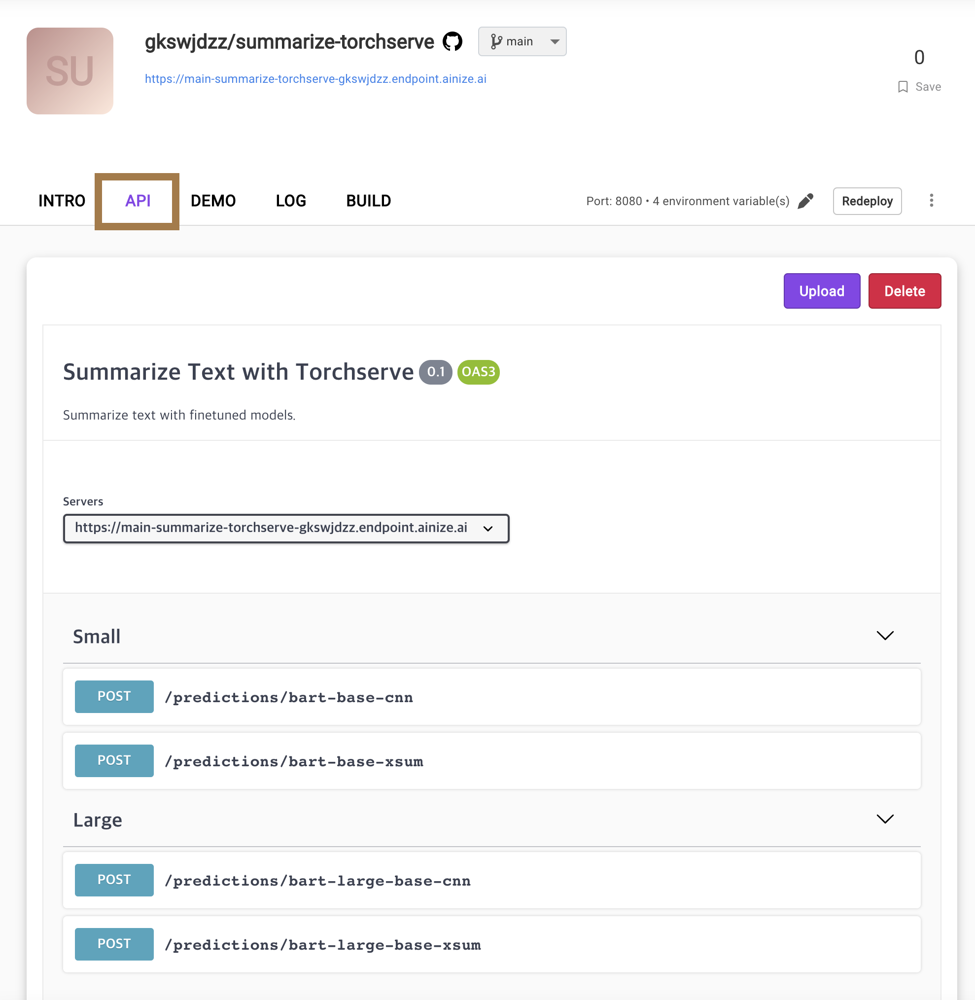
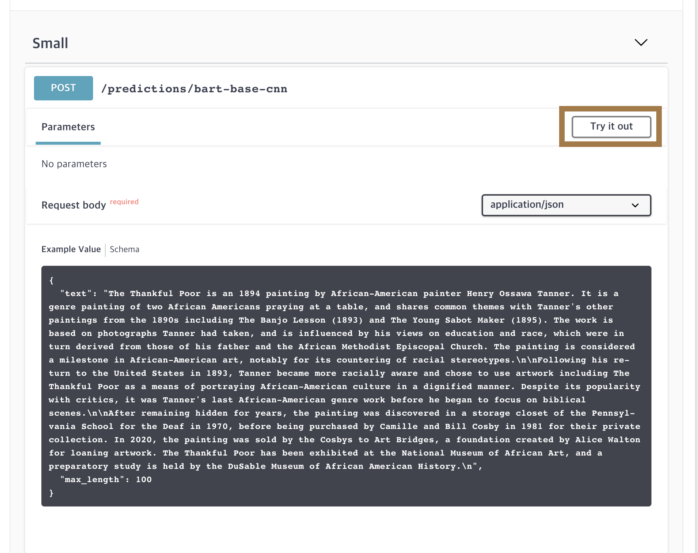
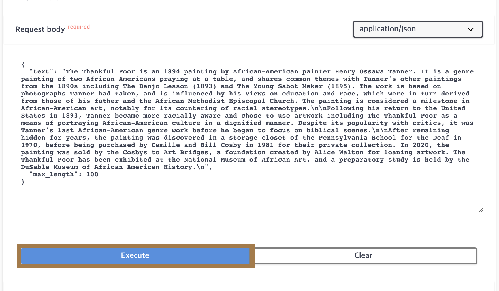

# Summarize text with fine-tuned model

> To use this api with swagger, click the link above!
> 
### 👉[DEMO](https://main-summarize-torchserve-gkswjdzz.endpoint.ainize.ai)

## How to use

1. Click API tab
# 

2. Click "Try it out" button if you want to use.
# 

3. Type text you want to summarize, and specify the max of length of output.
# 
